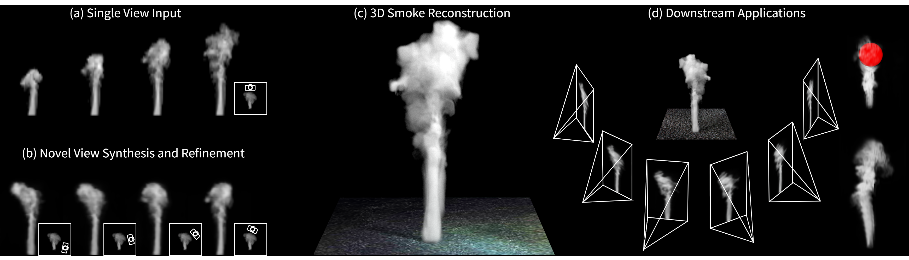
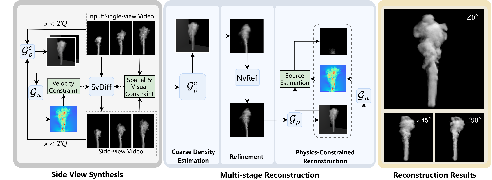

# **SmokeSVD: Smoke Reconstruction from A Single View via Progressive Novel View Synthesis and Refinement with Diffusion Models** (CVPR 2026)



## **Method Overview**



Given a single-view smoke video, SmokeSVD:

1. **Synthesizes an auxiliary side view** to reduce geometric ambiguity.
2. **Progressively refines novel views** from near to far angles with a cyclic 2D↔3D loop.
3. **Reconstructs 3D density** and estimates **velocity/inflow** with differentiable advection for physically plausible dynamics.

---

## **Installation**

```
# build environment with python 3.10
conda create -n smokeSVD python=3.10 -y
conda activate smokeSVD 

# install PyTorch
pip install torch torchvision torchaudio --index-url https://download.pytorch.org/whl/cu128

# install required packages
pip install -r requirements.txt
```

### **Requirements**

- GPU >= 24G

---

## **Data Preparation**

```
# Download Scalarflow datasets, please refer to  [website](https://ge.in.tum.de/publications/2019-scalarflow-eckert/)

# Create the data folder
mkdir data

# Move the downloaded dataset into the data folder
# For example:
# mv path_to_downloaded_dataset/* data/
```


---

## **Getting Started**

### Adjusting Parameters

```
# Rec.py
# Validation sequence index (depends on your dataset numbering, e.g., sim_xxx)
scalarflow_valindex = 0  

# Frame range to process
start_frame = 20          
end_frame = 139         

# Dataset selection
dataset = "scalarflow"    # options: "scalarflow" or others
```

### Run

Run `python Rec.py` to start reconstruction.

---

## BibTex

If this work is helpful for your research, please consider citing:

```jsx
@inproceedings{li2026smokesvd,
title     = {SmokeSVD: Smoke Reconstruction from A Single View via Progressive Novel View Synthesis and Refinement with Diffusion Models},
author    = {Chen Li and Shanshan Dong and Sheng Qiu and Jianmin Han and Yibo Zhao and Zan Gao and Taku Komura and Kemeng Huang},
booktitle = {Proceedings of the IEEE/CVF conference on computer vision and pattern recognition},
year      = {2026}
}
```

---
